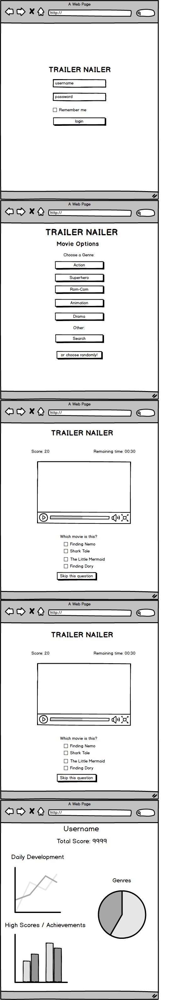

COMP20 Final Project Proposal

by: Minh D. Nguyen, Huynh Tran, Tomo Iwasaki, Arpan Gurung, Georgios Frantzis Phylactopoulos

Project title: Trailer Nailer

Problem statement:
- Create a website that allows user to play a movie recognition game. In each play, user will watch a short part of a movie trailer video and identify the movie.
- The website will allow the user to choose to do the quiz on movies of the same year, same genre, or just random movies.
- The website will allow users to challenge each other to find the “true” movie nerd!

How to solve the problem:
- Use YouTube API to get movie trailer from YouTube and the information of each movie.
- Use server-side database to store user’s information such as authentication information and high scores, and movie’s information such as YouTube ID, movie name, year of production, and genre.
- Use client-side storage to retain user’s login information.
- Send email/SMS and push notification whenever someone receives a challenge from others.

Features that we will implement:
- Server side data persistence.
- Client side persistence.
- Front-end framework.
- Send emails, SMSs, and push notifications.
- Charts and graphs.

Data the prototype will be collecting:
- Movie’s information from YouTube.
- User’s email and phone number (optional).

Algorithms or special technique:
- Selection algorithm to select movies based on user preferences. (e.g. genre, local bands only, etc.)
- Randomized algorithm to choose a random part of the trailer to play and to randomized a playlist.

Mockup:

#Comments by Ming
* I was going to ding you for listing a bunch of technologies under "Features that we will implement" as they are not features.  Your "How to solve the problem" is essentially the list of features.  Way cool of an idea!
* But isn't this game rather easy if one can see the music video?
